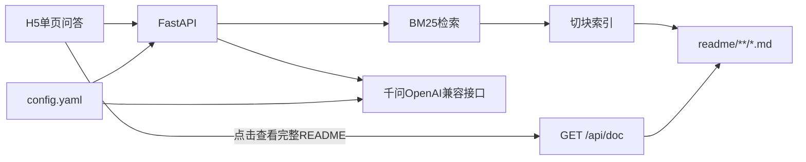

# 数据血缘 README 检索 · 网页应用实现计划

> 用途：新开 Agent/窗口按本文落地实现。  
> 最后更新：2026-09-24  
> 状态：已实现（代码位于 `E:\支架项目\apps\lineage-qa/`；知识库 `readme/`、业务代码 `src/`）

---

## 1. 目标

做一个**本机可独立启动**的网页应用（**不是** Cursor Skill）：

1. 用户自然语言提问：查**表** / **字段** / **业务名词**
2. 后端检索仓库知识库 `readme/**/*.md`（按 `##` 切块）
3. 用**通义千问**（配置文件中的 AK + 接口地址）生成回答
4. 回答必须固定三幕式 Markdown，便于 H5 渲染
5. 当结果能**精确到表或字段**时，提供「查看完整 README」；点击后在页面内展示该文档**全文**

知识库来源：只读 `readme/` 下已有 README（含业务含义、管理意义、表/字段、上下游血缘）。**禁止编造**文档中不存在的表、字段、血缘。

---

## 2. 已确认决策

| 项 | 选择 |
|----|------|
| 部署 | 本机独立启动（uvicorn），**不接** Dify / ChatBI / 天玑 |
| 大模型 | 通义千问 · DashScope **OpenAI 兼容** HTTP 接口 |
| 密钥与地址 | 配置文件 `apps/lineage-qa/config.yaml` |
| 样例配置 | 提交 `config.example.yaml`；真实 `config.yaml` 必须 **gitignore** |
| 完整文档 | 精确命中表/字段时可点开整份 README（非仅检索 chunk） |
| 检索 | v1 用 BM25/关键词，**不上**向量库 |
| 数仓 | **不**调用 ODPS / Dataphin / text-to-SQL |

---

## 3. 架构



| 层 | 实现 |
|----|------|
| 目录 | `apps/lineage-qa/`（与 `src/`、`readme/` 并列） |
| 后端 | FastAPI + 静态托管前端 |
| 前端 | 单页 H5：三幕式答案 + 来源列表 + 完整文档抽屉 |
| 知识库 | 扫描 `readme/**/*.md`，按二级标题 `##` 切块；保留 `file → 全文` 映射 |
| LLM | 读配置中的 `base_url` / `api_key` / `model`，用 OpenAI 兼容 SDK 调用 |

---

## 4. 建议目录结构

```text
apps/lineage-qa/
  README.md                 # 启动与配置说明
  requirements.txt
  config.example.yaml
  config.yaml               # 本地自建，勿提交
  .gitignore                # 忽略 config.yaml
  prompts/
    system.md               # 三幕式 system prompt（见 §9）
  static/
    index.html              # H5 问答页
    app.js
    style.css
  app/
    __init__.py
    main.py                 # FastAPI 入口
    config.py               # 加载 yaml
    ingest.py               # 切块与索引
    retrieve.py             # BM25
    llm.py                  # 千问调用
    schemas.py              # 请求/响应模型
```

仓库根 `.gitignore` 或本目录 `.gitignore` 增加：`apps/lineage-qa/config.yaml`。

---

## 5. 配置文件约定

`apps/lineage-qa/config.example.yaml`：

```yaml
readme_dir: ../../readme   # 相对 apps/lineage-qa
server:
  host: 127.0.0.1
  port: 8765
llm:
  # 通义千问 DashScope OpenAI 兼容模式
  base_url: https://dashscope.aliyuncs.com/compatible-mode/v1
  api_key: "YOUR_DASHSCOPE_API_KEY"
  model: qwen-plus          # 可改为 qwen-turbo / qwen-max 等
  timeout_sec: 120
retrieval:
  top_k: 8
```

启动时加载 `config.yaml`；缺文件或 `api_key` 仍为占位符时，`/api/chat` 返回明确配置错误提示。

---

## 6. API 设计

### 6.1 `POST /api/chat`

请求：

```json
{ "query": "用户自然语言问题" }
```

响应：

```json
{
  "answer_markdown": "【🔍意图识别】...\n【🧠思考推理过程】...\n【📋最终结果总结】...",
  "sources": [
    {
      "file": "readme/README_xxx.md",
      "heading": "3. 字段血缘-金额计算组",
      "score": 12.3
    }
  ],
  "matched_docs": [
    {
      "file": "readme/README_xxx.md",
      "title": "表元数据：ads_xxx",
      "hit_headings": ["3. 字段血缘-金额计算组"],
      "precise": true
    }
  ]
}
```

编排：检索 top_k chunks → 拼入 user/context → 调千问（带 system.md）→ 返回。

### 6.2 `GET /api/doc`

- Query：`path=readme/README_xxx.md`，可选 `heading=`
- 仅允许解析到配置的 `readme_dir` 之下，**防目录穿越**
- 返回：`{ "path", "title", "markdown" }` 全文
- 前端用 `heading` 打开后滚动到对应 `##` 锚点

### 6.3 其它

- `POST /api/reindex`：重扫 `readme/` 刷新切块索引
- `GET /health`
- `GET /`：托管 `static/index.html`

---

## 7. 完整 README 查看

### 何时展示「查看完整 README」

满足任一即视为「可精确到表/字段」，展示可点击文档卡片：

1. 命中块元数据含明确**表名**（如 `README_ads_xxx.md` / 块内表名），或查询实体与文档标题强匹配
2. 命中块属于**字段血缘**类，且 query/实体能对上字段名
3. `/api/chat` 返回的 `matched_docs` 中 `precise: true` 非空

模糊业务词、无可靠表/字段锚点：仍可列 sources 路径，但**不强调**主按钮（或提示「未精确到单表文档」）。

### 前端交互

- 答案下方：文档卡片（文件名/表题）+「查看完整 README」
- 点击后右侧或全屏**抽屉**：Markdown 渲染全文
- 若有 `hit_headings`：高亮并滚动到首个命中节
- 抽屉可关闭，标题栏显示路径

---

## 8. 前端（H5）

- 输入框 + 发送；加载态
- 回答区按三节渲染：`【🔍意图识别】` / `【🧠思考推理过程】` / `【📋最终结果总结】`（可用 Markdown 库如 marked）
- 底部来源列表 + 精确命中时的完整文档入口 + 抽屉
- 样式简洁清晰，适合本机使用即可（不必过度设计）

---

## 9. System Prompt（须 verbatim 写入 `prompts/system.md`）

以下为产品应答规范，实现时写入 system prompt，并追加三条硬约束：

- 上下文**仅**来自本请求附带的「检索片段」
- 片段中未出现的表/字段/链路**不得**写出
- 输出必须含且仅按序三节标题

### 角色与任务规则（原文）

你是数据血缘&代码文档检索智能助手，知识库由大量代码README文件组成，文档内包含代码实现逻辑、业务知识、管理意义、数据表、字段、上下游数据血缘关系。

#### 任务规则

1. 用户输入支持三类查询：数据表查询、字段查询、业务名词查询；用户使用自然语言提问，不一定是标准关键词。
2. 回答必须分为【🔍意图识别】【🧠思考推理过程】【📋最终结果总结】三大部分，顺序不可调换。
3. 【🔍意图识别】：
    - 识别用户查询目标：是查表、查字段、查业务概念？
    - 提取实体：表名/字段名/业务名词；
    - 识别用户真实诉求：查上游来源、下游输出、完整血缘链路、业务含义、代码逻辑、管理意义，还是综合查询；
    - 判断是否存在实体歧义，如果有列出歧义项。
4. 【🧠思考推理过程】：**完整展示你的思考步骤，不能省略**
    步骤模板：
    Step1：根据提取的实体，检索知识库README文档，筛选匹配的文档
    Step2：从文档中提取对应实体的业务含义、管理意义
    Step3：梳理数据血缘：上游数据源、ETL/代码处理逻辑、下游依赖表/字段，标注数据流转链路
    Step4：校验信息完整性，判断知识库是否缺少相关信息；如果信息不足，明确说明缺少哪部分内容
    Step5：组织信息，准备输出精简总结
5. 【📋最终结果总结】：
    - 精简输出，分块：业务说明、管理意义、数据血缘链路、关联代码信息；
    - 如果有多条血缘分支，逐条列出；
    - 如果知识库无匹配内容，直接告知：当前知识库未检索到相关信息，并提示用户更换表名/字段/业务名词重试。

#### 约束

- 思考过程要真实还原检索推理，不要笼统一句话；
- 禁止在思考过程提前输出最终答案；思考和总结严格分开；
- 所有信息必须来源于提供的README知识库，禁止编造不存在的表、字段、血缘；
- 当用户提问模糊时，在意图识别部分指出模糊点，并在总结里给出建议提问方式；
- 输出格式保持Markdown，方便H5前端渲染展示。

---

## 10. 实现任务清单

按顺序完成：

1. [ ] 新建 `apps/lineage-qa/` 骨架：FastAPI、requirements、`config.example.yaml`、gitignore
2. [ ] 实现 `readme/` 按 `##` 切块索引（启动加载 + `/api/reindex`），保留整文件路径映射
3. [ ] BM25 检索 + `/api/chat`（sources + matched_docs）+ 千问调用
4. [ ] `GET /api/doc` 安全读全文
5. [ ] `prompts/system.md` + 前端三幕式渲染与来源列表
6. [ ] 精确命中时「查看完整 README」抽屉（可锚到 `##`）
7. [ ] `apps/lineage-qa/README.md`：复制配置、填 AK、启动命令、刷新索引、文档查看说明

建议启动命令（写入 README）：

```bash
cd apps/lineage-qa
copy config.example.yaml config.yaml   # Windows；填入真实 api_key
pip install -r requirements.txt
uvicorn app.main:app --host 127.0.0.1 --port 8765
```

浏览器打开：`http://127.0.0.1:8765/`

---

## 11. 明确不做（本迭代）

- 不新建 Cursor Skill，不改 `.cursor/skills`
- 不接入 Dify / ChatBI / 天玑 SQL 执行
- 不上向量数据库（可列为 v2）
- 不改写现有 `readme/` 正文内容（只读消费）

---

## 12. 验收标准

- [ ] 配置好 `config.yaml` 后本机启动，浏览器可问答
- [ ] 回答严格三幕式；有/无命中行为符合 §9
- [ ] `sources` 可回溯到具体 `readme/*.md` 的 `##` 块
- [ ] 精确到表/字段时出现「查看完整 README」；点击可见全文并可定位命中章节
- [ ] 非法 `path`（跳出 readme 目录）被拒绝
- [ ] 应用内 README 写清配置、启动与文档查看用法

---

## 13. 相关仓库路径（实现时参考）

| 路径 | 作用 |
|------|------|
| [readme/](../readme/) | 知识库语料 |
| [.cursor/skills/sql-table-rag-metadata/SKILL.md](../.cursor/skills/sql-table-rag-metadata/SKILL.md) | `##` 切块与血缘文档规范 |
| [readme/RAG_ads_fin_tracker_comparison_summary_df.md](../readme/RAG_ads_fin_tracker_comparison_summary_df.md) | RAG 文档样例 |
| [doc/指标语义分析平台四系统架构设计完整文档.md](指标语义分析平台四系统架构设计完整文档.md) | 四系统架构（本应用 v1 **不接入**） |

---

## 14. 新窗口开场建议话术

可直接对 Agent 说：

> 请严格按 [doc/血缘检索Web应用计划.md](血缘检索Web应用计划.md) 实现 `apps/lineage-qa/` 网页应用，不要做 Cursor Skill，不要接 Dify。完成后按 §12 自检。
